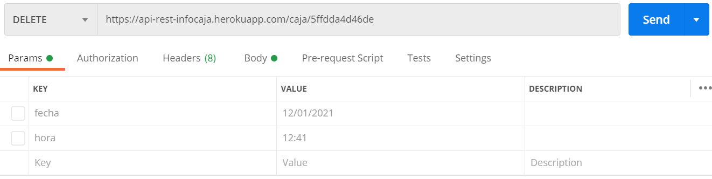

# API REST Información de Caja

_API REST que consiste en lectura del número de caja que se almacena en una base de datos de MongoDB Atlas juntamente con la fecha y hora actual en el momento que se realiza la petición. Presenta un reporte de tipo JSON, el mismo que puede ser filtrado por rango de fechas y por número de caja. Además, permite la eliminación de un registro de caja según el id que le pertenece. Estas funcionalidades solo pueden ser utilizadas por un usuario Administrador, creado previamente y debe loguearse para obtener un token que permitirá el acceso a las funcionalidades de la API REST. Este ejemplo es tomado de un caso de estudio real de Infinity Plus_

## Aplicación 🚀

_Esta aplicación REST se encuentra dezplegada en Heroku [API-REST-INFORMACION-CAJA](https://api-rest-infocaja.herokuapp.com/) Es posible usar Postman para probar la funcionalidad de la aplicación_

### Dependencias📋

* body-parser - Middleware de análisis del cuerpo
* express - Framework web
* mongoose - Base de Datos
* bcrypt - Codificar contraseñas
* jsonwebtoken - JSON Web Tokens
* mongoose-unique-validator - Validación de datos únicos


## Ejemplos de Ejecución ⚙️

_Los ejemplos presentados a continuación fueron realizados en **Postman**_

### Método POST - Login

_Un usuario registrado previamente puede iniciar sesión proporcionando el email, contraseña y el role de usuario. Es necesario iniciar sesión como Administrador para poder realizar todos las funcionalidades presentadas a continuación, haciendo uso del token que se genera al loguearse_

### Token

_El token generado debe ser colocado en cada petición como se muestra en la imagen_

### Método POST

_Utilizado para el almacenamiento de registro de caja en la base de datos_

```
https://api-rest-infocaja.herokuapp.com/caja
```


### Método GET

_Utilizado para obtener un reporte ya sea filtrado por rango de fechas o por número de caja_

**Por rango de fechas**
```
https://api-rest-infocaja.herokuapp.com/cajaFecha?fecha_desde=12/01/2021&fecha_hasta=19/01/2021
```


**Por número de caja**
```
https://api-rest-infocaja.herokuapp.com/numeroCaja?n_caja=10
```


**Todos**
```
https://api-rest-infocaja.herokuapp.com/cajas
```


### Método DELETE

_Utilizado para eliminar un registro según el id_

```
https://api-rest-infocaja.herokuapp.com/caja/5ffdda4d46de
```



## Despliegue 📦

El deploy de la aplicación se lo realizó en Heroku.
Tomando como referencia [Inicio Heroku](https://devcenter.heroku.com/articles/heroku-cli#getting-started) para iniciar sesión en la cuenta de Heroku creada previamente y para el dezpliegue de la aplicación se lo realizó con GIT como se describe en la documentación: [Deploy Git](https://devcenter.heroku.com/articles/heroku-cli#getting-started)

### **Zona Horaria**
La aplicación hace uso de Date() proveniente de JavaScript por lo que es necesario modificar la zona horaria de Heroku con el fin de obtener una fecha y hora correcta para lo cual es necesario revisar la documentación: [Time Zone Heroku](https://dev.to/paulasantamaria/change-the-timezone-on-a-heroku-app-2b4) 

### **Variables Configuración**
La aplicación hace uso de variables que por seguridad se configuran en el servidor. Las variables como la URL para la conexión a la base de datos en MongoDB Atlas y la variable de validación para la generación de tokens, fueron configuradas en el servidor siguiendo la guía: [Config Vars](https://devcenter.heroku.com/articles/config-vars) 


## Construido con 🛠️

* [Visual Studio Code](https://code.visualstudio.com/) - Editor de código
* [Postman](https://www.postman.com/) - Usado y recomendado para probar la API
* [MongoDB Atlas](https://www.mongodb.com/cloud/atlas) - Usado para la base de Datos en la nube

## Autores ✒️

* **Andrea Lizeth González Lasso** 

