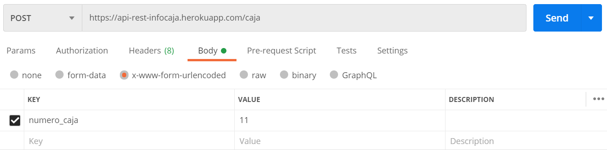
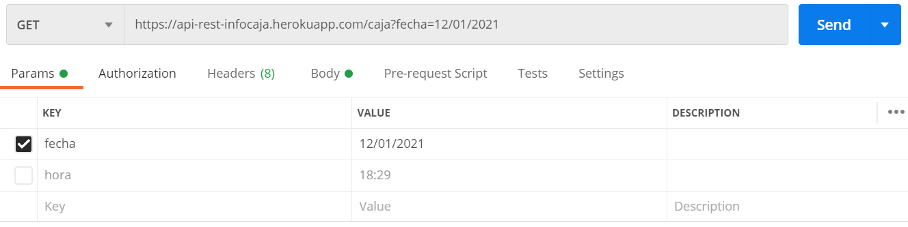
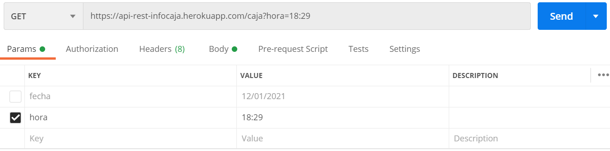
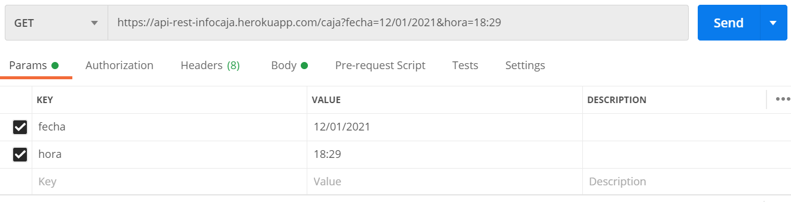

# API REST Información de Caja

_API REST que consiste en lectura del número de caja que se almacena en una base de datos de MongoDB Atlas juntamente con la fecha y hora actual en el momento que se realiza la petición. Presenta un reporte de tipo JSON, el mismo que puede ser filtrado por fecha, hora o por las dos. Además, permite la eliminación de un registro de caja según el id que le pertenece. Este ejemplo es tomado de un caso de estudio real de Infinity Plus_

## Aplicación 🚀

_Esta aplicación REST se encuentra dezplegada en Heroku [API-REST-INFORMACION-CAJA](https://api-rest-infocaja.herokuapp.com/) Es posible usar Postman para probar la funcionalidad de la aplicación_

### Dependencias📋

* body-parser - Middleware de análisis del cuerpo
* express - Framework web
* mongoose - Base de Datos


## Ejemplos de Ejecución ⚙️

_Los ejemplos presentados a continuación fueron realizados en **Postman**_

### Método POST

_Utilizado para el almacenamiento de registro de caja en la base de datos_

```
https://api-rest-infocaja.herokuapp.com/caja
```


### Método GET

_Utilizado para obtener un reporte ya sea filtrado por fecha, por hora o por ambos_

**Por fecha**
```
https://api-rest-infocaja.herokuapp.com/caja?fecha=12/01/2021
```



**Por hora**
```
https://api-rest-infocaja.herokuapp.com/caja?hora=18:29
```




**Por fecha y hora**
```
https://api-rest-infocaja.herokuapp.com/caja?fecha=12/01/2021&hora=18:29
```




**Todos**
```
https://api-rest-infocaja.herokuapp.com/caja
```


### Método DELETE

_Utilizado para eliminar un registro según el id_

```
https://api-rest-infocaja.herokuapp.com/caja/5ffdda4d46de
```


## Despliegue 📦

El deploy de la aplicación se lo realizó en Heroku.
Tomando como referencia [Inicio Heroku](https://devcenter.heroku.com/articles/heroku-cli#getting-started) para iniciar sesión en la cuenta de Heroku creada previamente y para el dezpliegue de la aplicación se lo realizó con GIT como se describe en la documentación: [Deploy Git](https://devcenter.heroku.com/articles/heroku-cli#getting-started)

### **Zona Horaria**
La aplicación hace uso de Date() proveniente de JavaScript por lo que es necesario modificar la zona horaria de Heroku con el fin de obtener una fecha y hora correcta para lo cual es posible revisar la documentación: [Time Zone Heroku](https://dev.to/paulasantamaria/change-the-timezone-on-a-heroku-app-2b4) 


## Construido con 🛠️

* [Visual Studio Code](https://code.visualstudio.com/) - Editor de código
* [Postman](https://www.postman.com/) - Usado y recomendado para probar la API
* [MongoDB Atlas](https://www.mongodb.com/cloud/atlas) - Usado para la base de Datos en la nube

## Autores ✒️

* **Andrea Lizeth González Lasso** 

